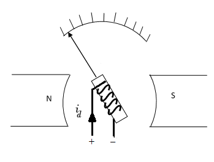

## Introduction

<b>Discipline | <b> Electrical Engineering 
:--|:--|
<b> Lab | <b> **Control and Instrumentation Laboratory**
<b> Experiment|     <b> **Transient and frequency response of D’Arsonval Galvanometer**

### About the Experiment 
**System description**

A D’Arsonval galvanometer is a device designed to detect small currents in order of nA or &micro;A. Its application lies in bridges (Wheatstone bridge, Kelvin double bridge etc.) and potentiometers, where it indicates null deflection or zero current.

The working principle of the galvanometer is based on the equation
$$\tau_d = \tau_r$$

Where &tau;d is the deflecting torque and &tau;d &Proportional; id (coil current) 
&tau;r is the restoring torque, brings the moving system (spring enabled) back to the initial position.

The galvanometer pointer movement shown in Fig. 1, employs a spring-loaded coil through which the measured current flows. 

 
<b>Fig. 1. D’Arsonval principle</b>

<b>Subject matter expertise | <b> **Prof. Alok Kanti Deb**
:--|:--|
<b> Institute | <b>  **Indian Institute of Technology Kharagpur**
<b> Email id|     <b>  **alokkanti@ee.iitkgp.ac.in**
<b> Department |  **Department of Electrical Engineering**
<b>Webpage| <b> http://www.iitkgp.ac.in/department/EE/faculty/ee-alokkanti

### Contributors List

SrNo | Name | VLabs Developer or Integration Engineer | Designation | Department| Institute
:--|:--|:--|:--|:--|:--|
1 | **Piyali Chattopadhyay** | Developer | Project Scientist | Department of Electrical Engineering | IIT Kharagpur | 
2 | **Subhasis Mahata** | Integration Engineer | Senior Project Scientist | Department of Mechanical Engineering | IIT Kharagpur |

<link href="experiment/simulation/css/galvano.css" rel="stylesheet">

