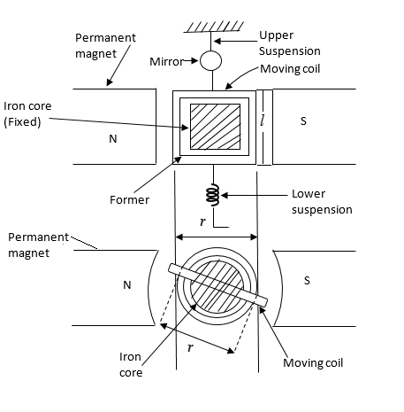

# Theory

<b>Galvanometer</b> 

The use of D'Arsonval galvanometer is very common in variety of measuring instruments. The galvanometer is basically used in an instrument for detecting the presence of small
currents in a circuit or to indicate zero current in applications like bridge circuits. Thus galvanometer has to be very much sensitive.  

<b>Construction</b> 
The construction of  D'Arsonval galvanometer is shown in the Fig. 1.
  

 
<b>Fig. 1. Construction of  D'Arsonval Galvanometer</b>  

 

It consists of the following parts, 

<b>1. Moving coil</b> 

It is the current carrying element. It is either rectangular or circular in shape and consists of a number of turns of fine wire. This coil is suspended so that it is free to turn about its vertical axis of
symmetry. It is arranged in a uniform, radial, horizontal magnetic field of a permanent magnet and iron core. The iron core is spherical in shape if the coil is circular but is
cylindrical if the coil is rectangular. The iron core is used to provide a flux path of low reluctance and therefore to produce strong magnetic field. This increases the deflecting torque and hence the sensitivity of the galvanometer. The length of air gap is about 1.5 mm.

  

<b>2. Damping</b> 
There is a damping torque present owing to production of eddy currents in the metal former on which the coil is mounted.
For effective damping a low resistance is connected across the galvanometer terminals. By adjusting the value of this resistance, damping can be changed and
critical damping can be achieved.  

<b>3. Suspension</b> 
The coil is supported by a flat ribbon suspension which also carries current to the coil. The other current connection in a sensitive galvanometer is a coiled wire. This is called the lower
suspension which has a negligible torque effect. This type of galvanometer must be levelled carefully so that the coil hangs straight and centrally without rubbing the poles or the soft iron cylinder. 
In galvanometers which do not require the perfect leveling, taut suspensions with straight flat strips are used, which are kept under tension from both top and the bottom sides. The upper suspension 
consists of gold or copper wire of nearly 0.0125 or 0.025 mm diameter rolled into the form of a ribbon.  

<b>4. Indication</b> 
The suspension carries a small mirror upon which a beam of light is cast through a glass window in the outer brass case surrounding the instrument.
The beam of light is reflected on the scale upon which the deflection is measured.  The scale is calibrated in mm and usually kept 1 m (1000 mm) away from the mirror as shown in Fig. 2.  

<b>5. Zero setting</b> 
A torsion head is provided for the adjustment of the coil position and zero setting.  				

 
<b>Fig. 2.  Measurement of deflection with lamp and scale arrangement </b>          

 	

<b>Torque Equation</b> 

Fig. 1 shows the parameters involved in the torque equation of a galvanometer. 

Let, 
l, r = Length of respectively vertical and horizontal side (width) of coil, m, 
N = Number of turns in the coil, 
B = Flux density in the air gap, Wb/m2, 
i = Current through moving coil, A, 
K = Spring constant of suspension, Nm/rad, 
K is known by various names like control constant, restoring constant and stiffness constant. 

&theta;F = Final steady state deflection of moving coil, rad. 

Force on each side of coil is N. Bil sin &alpha; 

where &alpha; = Angle between direction of magnetic field and the conductor. 

The field is radial and, therefore, &alpha; is 90&deg; 
Hence, force on each side of coil (Fc) 

$$F_c = NBil \tag{1}$$

Deflecting torque Td = force &times; distance  

$$= NBilr \tag{2}$$
$$= NBAi \tag{3}$$
where A = lr = area of coil, m2 
N, B, A are constants for a galvanometer.

Hence deflecting torque (Td)

$$T_d = G i \tag{4}$$

where 
$$G = NBA = NBlr \tag{5}$$

G is called the displacement constant of the galvanometer. 

Controlling torque exerted by the suspension at deflection &theta;F, is 

$$T_c = K \theta_F \tag{6}$$

For final steady deflection,

$$T_c = T_d$$

or

$$K \theta_F = G i$$

Hence, final steady deflection

$$\theta_F = \frac{G i}{K} \tag{7}$$

If the deflection is measured on a mm scale kept 1 metre away and if &theta;F is small, the deflection d (mm) (Fig. 2) is given by : 

d = Radius &times; Angle turned by the reflected beam 
Hence,

$$d = 1000 \times 2 \theta_F = 2000 \ \frac{Gi}{K} \tag{8}$$

This is because if the deflection is &theta;F, the mirror turns through an angle &theta;F while the reflected beam turns through an angle 2&theta;F.  

<b>Instrinsic constants of galvanometer</b> 
Various instrinsic constants of galvanometer are,  

<b>1. Displacement constant (G) :</b> The deflecting torque is given by 

$$T_d = G i \ (see \ Eqn. \ 4)$$

where G is the displacement constant of the galvanometer and is equal to NBlr. The unit of G is Nm/A. 

<b>2. Constant of inertia (J) :</b> A retarding torque is produced owing to inertia of moving system. This torque is dependent upon the moment of inertia of moving system and the angular acceleration.

$$T_i = J \frac{d^2\theta}{d t^2} \tag{9}$$
where, J = Moment of inertia of moving system about the axis of rotation, kg-m^2 

<!-- $$\frac{d^2\theta}{d t^2} = Angular \ acceleration$$ -->
&theta; = Deflection at any time t 

J is also called the inertia constant.  

<b>3. Damping constant (D) :</b>. Damping is provided by the friction due to motion of the coil in air and also by induced electrical effects if a closed circuit is provided. 
Damping torque is assumed to be proportional to velocity of the moving system. This is true for electro-magnetic damping and is at least a fair approximation for air damping.

$$T_D = D \frac{d\theta}{d t} \tag{10}$$

where, TD is damping torque, D is damping constant in Newton-meter/rad s-1  

<b>4. Control constant (K) :</b> A controlling torque is produced due to elasticity of the system which tries to restore the moving system back to its original position.

$$T_c = K \theta \tag{11}$$

where, Tc is controlling torque, K = control constant or restoring constant in Newton-meter/rad  

<b>Dynamic Behaviour of Galvanometer</b> 

  
<b>Fig. 3. Torque acts in galvanometer motion</b>

 

<b>Equation of Motion</b> 
There are four torques acting on the moving system. Deflecting torque, Td, tries to accelerate the system while inertia torque, Ti 
damping torque, TD and the control torque, Tc, try to retard the system. 

Therefore, for any deflection &theta; at any instant t

$$T_i + T_D + T_c = T_d$$		   

$$J \frac{d^2 \theta}{dt^2} + D \frac{d\theta}{dt} + K\theta = Gi \tag{12}$$

  The solution of equation 12 has two parts, 

1) Complementary function 
2) Particular integral. 

The complementary function (C.F.) represents the transient behaviour while particular integral (P.I.) represents the steady state condition i.e. final deflection of the moving system.
The behaviour of system before it achieves the steady state is transient behaviour. When transient behaviour dissipates, the system settles into its ultimate steady state position.
  

<b>Complementary function</b> 

The auxiliary equation of the differential equation (Eqn. 12) is obtained as,

$$J m^2 + D m + K = 0 \tag{13}$$

The roots of the equation 13 are,

$$m_1 = \frac{-D+\sqrt{D^2 - 4JK}}{2J} , m_2 = \frac{-D-\sqrt{D^2 - 4JK}}{2J}$$

Hence the solution has two exponential terms of power m1  and m2  	

$$\theta = A e^{m_1 t} + B e^{m_2 t} \tag{14}$$

where A,B are constants.  

<b>Particular integral</b> 

A steady current i is passed through the galvanometer. 
Under steady state conditions,

$$\frac{d \theta}{dt}=0 , \frac{d^2 \theta}{dt^2}=0, \theta = \theta_F$$

Putting the above conditions in Eqn. 12, the final steady state deflection is

$$\theta_F = \frac{G i}{K} \tag{15}$$

Thus, the complete solution of differential equation is

$$\theta = A e^{m_1 t} + B e^{m_2 t} + \theta_F \tag{16}$$

Now the transient terms may be purely exponential or oscillatory which depends on the nature of roots m1  and m2. This defines the various damping conditions of the system. 	
  

<b>Underdamped motion (D2 &lt; 4JK)</b> 

Both m1  and m2 are complex conjugates of each other having negative real part. 
Thus under these conditions the motion is oscillatory. The galvanometer oscillates about its final steady position with decreasing amplitude before finally settling at its final steady position. The 
galvanometer is underdamped in this case.

$$m_1,m_2 = -\frac{D}{2J} \pm j\frac{\sqrt{4JK - D^2}}{2J} = -\alpha \pm j\omega_d$$

$$D^2 - 4JK \lt 0 $$

In this case solution will be,

$$\theta = \theta_F \ [ 1 - \frac{2\sqrt{J K}}{\sqrt{4JK - D^2}}  e^{\frac{-D}{2J}t}  sin( \omega_d t + tan^{-1} \frac{\sqrt{4JK - D^2}}{D} ) ] \tag{17}$$

where,

$$\omega_d = \frac{\sqrt{4JK - D^2}}{2J}$$

When a current is suddenly passed through the coil of an underdamped galvanometer, the moving system will start from its zero current position and then oscillate about its final steady state position 
&theta;F. This oscillation would be an attenuated sinusoidal motion. The angular frequency of the sinusoidal component of this motion is 
&omega;d. The frequency of this sinusoidal component (called frequency of damped oscillations) is

$$f_d = \frac{\omega_d}{2 \pi} \tag{18}$$

and the time period is :

$$T_d = \frac{1}{f_d} = \frac{2 \pi}{\omega_d} \tag{19}$$

 
<b>Undamped motion</b> 
The undamped motion of a galvanometer is obtained when there are no damping forces i.e., when D = 0. Such a case is not possible under practical working conditions, but the properties of the 
undamped galvanometer are used in expressing its motion under actual operating conditions.  

For undamped motion the Angular frequency (&omega;n (rad/s)), 
$$\omega_n = \sqrt{\frac{K}{J}} \tag{20}$$
putting D = 0 in 

$$\frac{\sqrt{4JK - D^2}}{2 J}$$

The frequency of undamped (called natural or free oscillation) is :
$$f_n = \frac{\omega_n}{2 \pi} = \frac{1}{2 \pi} \sqrt{\frac{K}{J}} \tag{21}$$

and the free period of oscillations is 

$$T_0 = \frac{1}{f_n} = 2 \pi \sqrt{\frac{J}{K}} \tag{22}$$

In this case the solution is 

$$\theta = \theta_F \ (1 - cos \omega_n t) \tag{23}$$

Thus the motion of the undamped galvanometer is an oscillation around &theta;F with a constant amplitude &theta;F and a frequency fn.

  

<b>Critically damped motion (D2 = 4JK)</b> 

For critical damping, the roots m1 and m2 are equal, real and negative. 
In this case the transient response is not oscillatory but purely exponential such that the pointer attains the steady state position very quickly.

$$m_1 = m_2 = \frac{-D}{2J}$$

$$D^2 - 4JK = 0 , D = 2\sqrt{JK}$$

In this case solution is, 

$$\theta = \theta_F \ [ 1 - e^{-\frac{D}{2J}}t ( 1 + \frac{D}{2J}t )] \tag{24}$$

Now for critical damping 

$$D = D_c = 2\sqrt{KJ}$$ 

where Dc = damping constant for critical damping. 

Under critical damping conditions 

$$\frac{D}{2J} = \frac{2 \sqrt{K J}}{2 J} = \sqrt{\frac{K}{J}} = \omega_n$$ 

<b>Over damped motion (D2 &gt; 4JK)</b> 

When the damping is more than the damping for critical case, the motion is called over damped and the roots m1 and m2 are real, unequal and negative.
For overdamped case the transient response is exponential and non oscillatory. The pointer attains final steady state position 
&theta;F exponentially, taking more time than that of critical damping.			

In this case solution is, 

$$\theta = \theta_F \ [ 1 + \frac{\zeta + \sqrt{\zeta^2 -1}}{2 \sqrt{\zeta^2 -1}}e^{-\omega_n t (\zeta - \sqrt{\zeta^2 -1})} - \frac{\zeta - \sqrt{\zeta^2 -1}}{2 \sqrt{\zeta^2 -1}}e^{-\omega_n t (\zeta + \sqrt{\zeta^2 -1})} ] \tag{25}$$
where natural frequency = &omega;n
$$\omega_n = \sqrt{\frac{K}{J}}$$

The above expression (Eqn. 23) represents a decaying motion without oscillations or overshoot. However, this motion is usually slow and is not desirable in indicating instruments. 
The value of &zeta; = D/ Dc. 
where, Dc = damping constant for critical damping.

			    
<link href="./simulation/css/galvano.css" rel="stylesheet">

								
